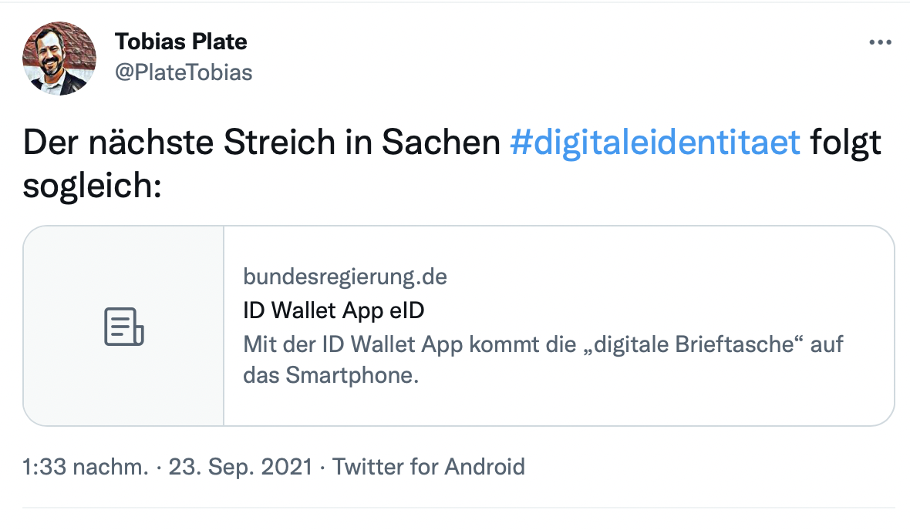
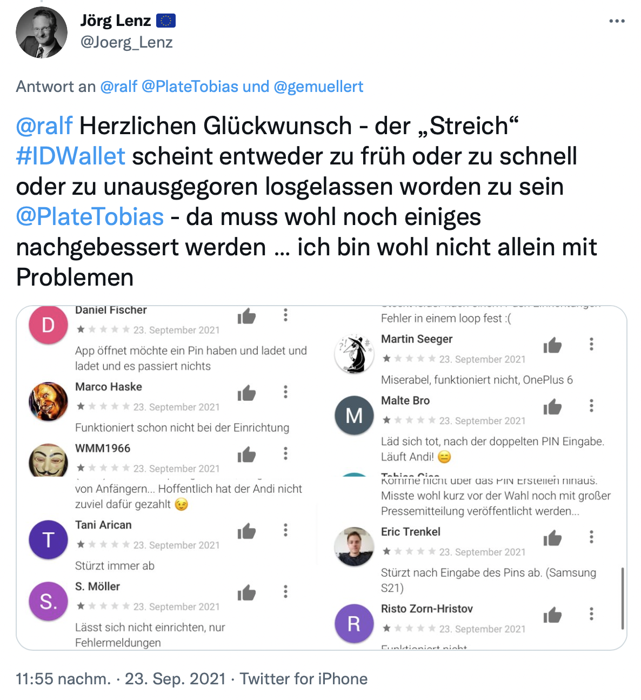
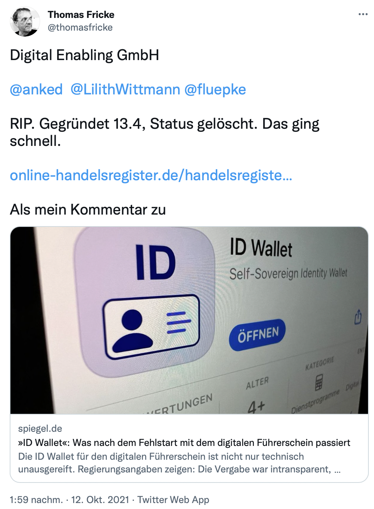

# Digitisation Fails - Eine kleine, kuratierte Liste von Fails oder solchen, die es werden könnten

[David Zellhöfer](https://www.hwr-berlin.de/hwr-berlin/ueber-uns/personen/2429-david-zellhoefer/) (CC BY-SA-NC; 4.0 2021f.)

## Disclaimer

Bei der folgenden Liste handelt es sich um eine subjektive Auswahl mit dem Fokus auf die öffentliche Verwaltung in Deutschland. Sie dient als Themenspeicher für meine Lehrveranstaltungen und andere Interessierte.

Wer Erkenntnisse zu dieser Liste beisteuern will, ist herzlich willkommen. Entweder per Issue, Merge Request auf GitHub oder per E-Mail. Meine Kontaktdaten sind oben verlinkt.

Das Gegenteil dieser Liste existiert [hier](https://github.com/codedust/awesome-egov-de).

## Einleitung

Die folgende Liste enthält diverse Fails, die viele wahrscheinlich lieber als "IT Fails" bezeichnen würden. Ich habe mich aber bewusst für den Begriff der "Digitisation Fails" entschieden. Man macht es sich meiner Meinung nach zu einfach, Probleme der digitalen Transformation mit Problemen der IT gleichzusetzen bzw. sie dieser zuzuschreiben. Tatsächlich sind die Ursachen der Fails wesentlich vielfältiger. Viele Probleme lassen sich aus meiner Sicht auf mangelndes Verständnis der digitalen Transformation, nicht erfolgter Anforderungsanalyse, mangelhafter Projektsteuerung oder Wissenschaftsleugnung zurückführen.

Ich versuche bei den einzelnen Fails die Ursachen einzuordnen.

Die Liste umfasst vor allem, aber nicht nur, Online-Quellen. Die meisten Quellen sind frei verfügbar.
## Allgemeine Impulse

* "Vater Staat wird nicht smart - Weitere Flops beim E-Government befürchtet (c't 2019/23)"
* ["Deutschland hat die Digitalisierung nicht verschlafen, sondern unterdrückt" (Süddeutsche)](https://www.sueddeutsche.de/digital/digitalisierung-politik-kommentar-1.5112615)
* [Staatliche IT: Warum es so schwer ist, gute Systeme zu entwickeln](https://www.heise.de/hintergrund/Staatliche-IT-Warum-es-so-schwer-ist-gute-Systeme-zu-entwickeln-5999494.html)
* [Digitalisierung in Deutschland –
Lehren aus der Corona-Krise; Gutachten des Wissenschaftlichen Beirats beim Bundesministerium für Wirtschaft und Energie (BMWi)](https://www.bmwi.de/Redaktion/DE/Publikationen/Ministerium/Veroeffentlichung-Wissenschaftlicher-Beirat/gutachten-digitalisierung-in-deutschland.pdf?__blob=publicationFile&v=4)
* Interessenskonflikt Staat und IT-Sicherheit [Keine Krypto vom Staat](https://www.golem.de/news/imho-keine-krypto-vom-staat-1309-101538.html)
* G. Dueck [Digitaler Workaround ist keine Digitalisierung](https://link.springer.com/article/10.1007/s00287-020-01326-8)
* Ehmers Blog [Dramatische digitale Inkompetenz](https://www.ehmers-blog.de/2021/dramatische-digitale-inkompetenz/)
* [Digitalkompetenz: Was wurde eigentlich aus der Bundeszentrale für digitale Aufklärung, Frau Bär?](https://netzpolitik.org/2021/digitalkompetenz-was-wurde-eigentlich-aus-der-bundeszentrale-fuer-digitale-aufklaerung-frau-baer/)
* [Scheinlösung Digitalministerium](https://www.stiftung-nv.de/de/publikation/scheinloesung-digitalministerium)
* [Awful AI:](https://github.com/daviddao/awful-ai) "Awful AI is a curated list to track current scary usages of AI - hoping to raise awareness to its misuses in society"
* [heise: Patch me if you can: Digitalisierungsschub durch Corona – Neulandunter?](https://www.heise.de/meinung/Patch-me-if-you-can-Digitalisierungsschub-durch-Corona-Neulandunter-6054772.html)

## Fails

### DeMail
Henne-Ei-Problem, keine Annahme in der ÖV, kein wirklicher Sicherheitsgewinn gegenüber klassischer E-Mail
sichere Lösung ohne Ende-zu-Ende-Verschlüsselung? nur optional mit PGP
* in 2021 steigt z.B. die Telekom aus
* [TELEKOM-CHEF: De-Mail ist ein "toter Gaul"](https://www.golem.de/news/telekom-chef-de-mail-ist-ein-toter-gaul-2103-154574.html)
* [Spiegel: Telekom schaltet De-Mail ab](https://www.spiegel.de/netzwelt/netzpolitik/telekom-schaltet-de-mail-ab-a-1cf7a036-c4ad-4d3c-b8d8-2f3d1afa7944)
* Meine erste DeMail:  [Bildquelle](https://twitter.com/lennybacon/status/1456190407755374596?s=20)

### Das besondere elektronische Anwaltspostfach
Fail, weil das BGH mit seiner Einschätzung kaum dem Stand der Technik folgt, davor gab es diverse technische Schwächen

* [beA: Das besondere elektronische Anwaltspostfach](https://www.brak.de/fuer-anwaelte/bea-das-besondere-elektronische-anwaltspostfach/)
* [Besonderes elektronisches Anwaltspostfach: Schadenersatzforderung und Vertröstungen](https://www.heise.de/newsticker/meldung/Besonderes-elektronisches-Anwaltspostfach-Schadenersatzforderung-und-Vertroestungen-3976424.html)
* [BGH: Kein Anspruch auf Ende-zu-Ende-Verschlüsselung beim Anwaltspostfach beA](https://www.heise.de/news/BGH-Kein-Anspruch-auf-Ende-zu-Ende-Verschluesselung-beim-Anwaltspostfach-beA-5995046.html)
### Contact Tracing (insb. Luca-App)

* Fail in so vielen Dimensionen, hinzu kommt Marketing und Influencer-Marketing durch Anteilseigner (Smudo/Fantastische Vier), die anfangs verdeckt blieben
* Von zu Beginn an fragwürdiges Vergabeverfahren (Auswahl Anbieter, Eignung Anbieter, keine Austellung von Requirements)
* Paradebeispiel für Solutionismus, eine App soll alle Probleme lösen
* App besteht jedoch aus technischen Schwachstellen, Use Cas für Gesundheitsämter unklar und sogar technische Bedrohung (u.a. CSV-Injection)
* Zielkonflikt mit Corona Warn App (CWA), die der Bund entwickeln ließ, die dann aber lange nicht weitergepflegt wurde
* außerdem sahen diverse Corona-Verordnungen die quasi ausschließliche Nutzung von Luca vor, wenn man eine digitale Erfassung machen wollte
    * [Spiegel: Darf ich ohne Luca-App jetzt nicht mehr zu Ikea?](https://www.spiegel.de/netzwelt/apps/coronakrise-darf-ich-ohne-luca-app-jetzt-nicht-mehr-zu-ikea-a-cab0558a-5c7d-4f84-80d2-451eebe95836)
    * [#22 Luca vs. Datenschutz (Podcast)](https://www.ndr.de/nachrichten/info/22-Vertrauen-ist-keine-gute-Technologie,audio868810.html)
    * https://www.tagesspiegel.de/berlin/betraechtliche-risiken-bei-corona-software-berlins-datenschutzbeauftragte-warnt-vor-luca-app/27079224.html
    * [Gesundheitsämter, die zurzeit von der Luca App Schnittstelle als im System bekannt gemeldet werden.](http://luca.denken.io)
    * [Luca-App für Kontakt-Tracking: Sicherheitslücke in Schlüsselanhängern gefunden](https://www.heise.de/news/Luca-App-fuer-Kontakttracking-Sicherheitsluecke-in-Schluesselanhaengern-gefunden-6015219.html)
    * Source Code:
        * https://gitlab.com/lucaapp
    * Meanwhile at Corona Warn-App - komplette Offenlegung:
        * https://github.com/corona-warn-app
    * [WDR: Drei Apps gegen Corona? – Ein unnötiges Chaos](https://blog.wdr.de/digitalistan/drei-apps-gegen-corona-ein-unnoetiges-chaos/)
    * [heise: Digitale Corona-Impfzertifikate: Was bisher falsch lief](https://www.heise.de/news/Digitale-Corona-Impfzertifikate-Was-bisher-falsch-lief-6156971.html)
    * [heise: Digitaler Impfnachweis: CovPass kostet fünfmal mehr als geplant](https://www.heise.de/news/Digitaler-Impfnachweis-CovPass-kostet-fuenfmal-mehr-als-geplant-6265804.html)
    * [Zeit: Corona-Warn-App- Besser, als Sie denken](https://www.zeit.de/digital/mobil/2021-06/corona-warn-app-bundesregierung-digitalisierung-infektionsketten-datenschut?utm_referrer=https%3A%2F%2Ft.co%2F)
    
    #### Chronologie 2021.

    [Generelle Timeline](https://timeline.luca.fail)

    * 25.03. [LUCA APP UND TICKET I/O GEHEN KOOPERATION EIN](https://landing.ticket.io/news/ticket-i-o-und-luca-gehen-kooperation-ein)
    * 31.03 Luca verletzt OSS-Lizenzen
        * [Problem 1](https://twitter.com/ralf/status/1377127671017054212?s=20)
        * [Problem 2](https://twitter.com/ralf/status/1377159413358682118?s=20)
    * 08.04. [Zeit: Luca-App trotz Kritik auf dem Vormarsch](https://www.zeit.de/news/2021-04/08/luca-app-trotz-kritik-auf-dem-vormarsch)
    * 08.04. [taz: Luca-Nepp](https://taz.de/Versagen-der-gehypten-Corona-App/!5759224/)
    * 08.04. [rbb24 Luca-App steht in Berlin offenbar kurz vor dem Start](https://www.rbb24.de/content/rbb/r24/politik/thema/corona/beitraege/2021/04/luca-app-berlin-gesundheitsamt-datenschutz.html)
    * 12.04. [Weimar: Das Weimarer Modell Testen – Lockern - Impfen;  Evaluation der Testphase 1](./sources/weimar_eval.pdf)
    * 13.04. [CCC: Luca-App: CCC fordert Bundesnotbremse](https://www.ccc.de/de/updates/2021/luca-app-ccc-fordert-bundesnotbremse)
    * 13.04. [SZ: "Luca" und das Problem mit den Schlüsselanhängern](https://www.sueddeutsche.de/wirtschaft/kontaktnachverfolgung-corona-app-tracking-datenschutz-1.5263996?reduced=true)
    * 14.04. [deutschlandfunk: Chaos Computer Club: „Keine Steuermittel mehr für Luca-App einsetzen“](https://www.deutschlandfunk.de/kontaktnachverfolgung-chaos-computer-club-keine.2849.de.html?drn:news_id=1248352)
    * 14.04. [Spiegel: Chaos Computer Club fordert Stopp von Luca](https://www.spiegel.de/netzwelt/apps/luca-chaos-computer-club-fordert-stopp-der-app-a-072c7828-604c-48ff-add0-09040cef481f)
    * 14.04. [SZ: Ministerium empfiehlt Luca-App trotz Kritik](https://www.sueddeutsche.de/gesundheit/gesundheit-stuttgart-ministerium-empfiehlt-luca-app-trotz-kritik-dpa.urn-newsml-dpa-com-20090101-210414-99-195710)
    * 15.04. [golem.de: Entwickler der Luca-App bezeichnen CCC-Kritik als überzogen](https://www.golem.de/news/stellungnahme-entwickler-der-luca-app-bezeichnen-ccc-kritik-als-ueberzogen-2104-155763.html)
    * 15.04. [Luca-App versus Open Source](https://www.heise.de/developer/artikel/Luca-App-versus-Open-Source-6016089.html)
    * 16.04. [heise: 
Nach wachsender Kritik aus IT-Kreisen: Landesdatenschützer prüft Luca-App](https://www.heise.de/news/Nach-wachsender-Kritik-aus-IT-Kreisen-Landesdatenschuetzer-prueft-Luca-App-6017564.html)
    * 16.04. [Interview radioeins mit Linus Neumann/CCC](https://www.radioeins.de/programm/sendungen/die_schoene_woche/_/chaos-computer-club-fordert-stopp-von-luca-app.html) (Sicherheitskopie nötig, da nur bis 16.05. online)
    * 16.04. [luca: Stellungnahme zum Schreiben des CCC vom 13. April 2021](https://www.luca-app.de/stellungnahme-zum-schreiben-des-ccc-vom-13-april-2021/)
    * 16.04. Corona Warn App [netzpolitik.org: „Dann hat man irgendwie das Interesse verloren“](https://netzpolitik.org/2021/bilanz-der-corona-warn-app-dann-hat-man-irgendwie-das-interesse-verloren/)
    * 16.04. [LfDI BaWü: Podcast Datenfreiheit – Folge 11: Luca App in der Kritik](https://www.baden-wuerttemberg.datenschutz.de/podcast-datenfreiheit-folge-11-luca-app-in-der-kritik/)
    * 16.04. [M. Waldvogel: Luca und andere Apps — Contact Tracing quo vadis?](https://dnip.ch/2021/04/16/contact-tracing-quo-vadis/)
    * 17.04. [Interview Berliner Zeitung: Gründer der Luca-App im Interview: „Wir erleben eine typisch deutsche Debatte“](https://www.berliner-zeitung.de/wochenende/gespraech-zu-luca-app-wir-erleben-jetzt-eine-typisch-deutsche-debatte-li.153041)
    * 17.04. [Nach massiver Kritik: Warum Bremen die Luca-App trotzdem nutzen will](https://www.butenunbinnen.de/nachrichten/politik/corona-warnapp-luca-einsatz-in-bremen-100.html)
    * 19.04. [heise: Kontaktverfolgung: Sormas bei 84 Prozent der Gesundheitsämter einsetzbar](https://www.heise.de/news/Kontaktverfolgung-Sormas-bei-84-Prozent-der-Gesundheitsaemter-einsetzbar-6020119.html)
    * 19.04. [Spiegel: IT-Sicherheitsbehörde prüft Luca-App](https://www.spiegel.de/netzwelt/apps/it-sicherheitsbehoerde-prueft-luca-app-a-651bc2fb-ea4d-4fb8-aeb4-62d87f654dfa)
        * siehe dazu [Aktualisierung am 17.08.](https://www.spiegel.de/netzwelt/netzpolitik/luca-app-innenministerium-lehnt-sicherheitspruefung-ab-a-a6dba9ed-6d12-4ead-945a-bf06d6fc0795)
    * 20.04. [taz: Sicher ist anders](https://taz.de/Streit-um-Luca-App-in-Berlin/!5767152/)
    * [Wikipedia-Eintrag](https://de.wikipedia.org/wiki/Luca_%28App%29#Vergabeverfahren)
    * 23.04. [der freitag: Luca kam, sah – und spionierte Corona Die Länder geben 20 Millionen Euro für eine überflüssige App aus](https://www.freitag.de/autoren/der-freitag/luca-kam-sah-und-spionierte)
    * 24.04. [netzpolitik.org: Warum im Voraus bezahlte Lizenzen eine schlechte Idee sind](https://netzpolitik.org/2021/luca-app-warum-im-voraus-bezahlte-lizenzen-eine-schlechte-idee-sind/)
    * 28.04. [taz: Datenschutzexperte über die Luca-App „Haufenweise Sicherheitslücken“](https://taz.de/Datenschutzexperte-ueber-die-Luca-App/!5762877/)
    * 29.04. [netzpolitk.org: Gesundheitsämter nutzen Luca kaum](https://netzpolitik.org/2021/digitale-kontaktnachverfolgung-gesundheitsaemter-nutzen-luca-kaum/)
    * 29.04. [iX: Corona-Tracking: Luca-Überwachung lässt sich mit Fake-Datenmüll aushebeln](https://www.heise.de/news/Corona-Tracking-Luca-Ueberwachung-laesst-sich-mit-Fake-Datenmuell-aushebeln-6031572.html)
    * 29.04. [Heise: Sicherheitsforscher: Risiken der Luca-App "völlig unverhältnismäßig"](https://www.heise.de/news/Sicherheitsforscher-Risiken-der-Luca-App-voellig-unverhaeltnismaessig-6031770.html)
        * [Gemeinsame Stellungnahme zur digitalen Kontaktnachverfolgung durch IT-Security-Professor*innen](https://digikoletter.github.io)
    * 29.04.[Zeit: Forschende halten Risiken der Luca-App für "völlig unverhältnismäßig"](https://www.zeit.de/digital/datenschutz/2021-04/luca-app-sicherheitsluecken-datenschutz-kritik-corona)
    * 29.04. [neXenio: Kurzstatement zu Forderungen von IT-Sicherheits­forscher:innen](https://www.luca-app.de/kurzstatement-forderungen-it-sicherheitsforscherinnen/)
    * 30.04. [Zeit: "Gesundheitsämter wollen nicht überhäuft werden mit Daten" - Interview mit Ulrich Kelber](https://www.zeit.de/digital/datenschutz/2021-04/ulrich-kelber-corona-warn-app-luca-datenschutz-check-in)
    * 30.04. [hessenschau: IT-Professor im Interview
Darum warnen Sicherheitsexperten vor der Luca-App](https://www.hessenschau.de/gesellschaft/it-professor-im-interview-darum-warnen-sicherheitsexperten-vor-der-luca-app,kritik-an-luca-app-100.html)
    * 30.04. [Spiegel: Oberster Datenschützer will Corona-Warn-App »die Fesseln abstreifen«](https://www.spiegel.de/netzwelt/corona-warn-app-oberster-datenschuetzer-will-app-die-fesseln-abstreifen-a-02ab0168-00a1-4b4e-b532-d2b6b563a0e8)
    * 30.04. [neXenio: Digitale Kontaktnach­verfolgung im Licht von IT-Sicherheit](https://www.luca-app.de/offizielle-stellungnahme-it-sicherheit-und-risikoabschaetzung/)
    * 03.05. [Zeit: "Bei Luca zahlen wir für ein Jahr Millionen und haben danach gar nichts" Interview mit Linus Neumann/CCC](https://www.sueddeutsche.de/politik/luca-app-corona-interview-1.5282528?reduced=true)
    * 04.05. [Zeit: Was bringt die Luca-App den Gesundheitsämtern wirklich?](https://www.zeit.de/digital/datenschutz/2021-04/luca-app-gesundheitsaemter-corona-kontaktverfolgung-hackerangriff-risiko?utm_referrer=https%3A%2F%2Ft.co%2F)
    * 04.05. [heise Developer: Episode 83: Architektur-Fehlschläge in aller Öffentlichkeit (am Beispiel Luca App)](https://www.heise.de/developer/artikel/Episode-83-Architektur-Fehlschlaege-in-aller-Oeffentlichkeit-6033205.html)
    * 04.05. [Tagesspiegel: Die Luca-App spielt für Berliner Gesundheitsämter noch keine Rolle](https://www.tagesspiegel.de/berlin/von-michael-mueller-propagiert-die-luca-app-spielt-fuer-berliner-gesundheitsaemter-noch-keine-rolle/27156680.html    )
    * 05.05. [Bundestag: Wie es um Sicherheit und Nutzen von Clusterer­kennungs-Apps steht](https://www.bundestag.de/dokumente/textarchiv/2021/kw18-pa-digitale-agenda-cluster-838094)
    * 05.05 [Anke Domscheit-Berg: Hopp oder Topp? Luca und Corona-Warn-App auf dem Prüfstand (Ausschussreport, 05.05.2021) __VIDEO__: 20:47](https://www.youtube.com/watch?v=b_jzjQSBUZo)
    * Lucia App
        * In Germany, the government is rolling out an app for QR code based contact tracing. The app claims to protect user data but actually it does not, at least at the time of writing. [...] The Lucia app is capable of generating fake QR codes that users can use to check in at locations while not providing any personal data whatsoever.
        * [Projektrepo Lucia](https://codeberg.org/errhammr/Lucia-App)
    * 06.05. [Kontaktverfolgung mit Luca: Osnabrück blamiert sich](https://osnablog.tumblr.com/post/650442585482067968/kontaktverfolgung-mit-luca-osnabrück-blamiert)
    * 06.05. [Luca-App: Mecklenburg-Vorpommern gewinnt Nachprüfungsverfahren mit Heuking](https://www.juve.de/nachrichten/verfahren/2021/05/luca-app-mecklenburg-vorpommern-gewinnt-nachpruefungsverfahren-mit-heuking)
    * 08.05. [Bianca Kastl: ADA, Bianca und CWA](https://bkastl.de/notes/ada-bianca-und-cwa-ausschuss-digitale-agenda-fachgespraech-clustererkennung)
    * 12.05. [Markus Feilner: „Warnen Sie Ihre Bürgerinnen und Bürger vor der Luca-App“](https://www.regensburg-digital.de/warnen-sie-ihre-buergerinnen-und-buerger-vor-der-luca-app/12052021/)
    * 13.05. [Bianca Kastel: Die Luca App - LucaTrack und andere Gefahren (__VIDEO__: 67min)](https://media.ccc.de/v/cccs-202105-lucatrack-und-andere-gefahren)
    * #LucaApp Performance Monitor [Welche Gesundheitsämter nutzen Luca](https://luca.denken.io)
    * 26.05. [heise: Gefahr für Gesundheitsämter: Luca-App ermöglicht Code Injection](https://www.heise.de/news/Gefahr-fuer-Gesundheitsaemter-Luca-App-ermoeglicht-Code-Injection-6054744.html)
    * 26.05. [netzpolitik.org: Schon wieder desaströse Sicherheitslücke in Luca App](https://netzpolitik.org/2021/it-sicherheit-schon-wieder-desastroese-sicherheitsluecke-in-luca-app/)
    * 26.05. [Zeit: Hacker können Gesundheitsämter über Luca angreifen](https://www.zeit.de/digital/2021-05/luca-app-gesundheitsaemter-hackerangriff-risiko-kontaktverfolgung-coronavirus/komplettansicht?utm_referrer=https%3A%2F%2Fwww.zeit.de%2Fzustimmung%3Furl%3Dhttps%253A%252F%252Fwww.zeit.de%252Fdigital%252F2021-05%252Fluca-app-gesundheitsaemter-hackerangriff-risiko-kontaktverfolgung-coronavirus%252Fkomplettansicht)
    * 26.05. [luca: Hinweis auf einen potentiellen Missbrauch des luca-Systems im Zusammenhang Microsoft Excel Code Injection](https://www.luca-app.de/hinweis-auf-einen-potentiellen-missbrauch-des-luca-systems/)
    * 03.06. [Video: Luca App: Nutzer greift Gesundheitsamt an und stiehlt Daten bevor er Ransomware schickt](https://vid.wildeboer.net/videos/watch/8aba8997-6dd0-45b2-9e14-d1eb1f259f3e)
    * 18.06. [bidt/Bay. Akademie d. Wissenschaften: Lessons Learned: Raus aus dem Lockdown mit der Luca-App?](https://www.bidt.digital/lessons-learned-luca-app/)
    * 21.06. [Die größten Pannen der Luca-App und was Entwickler:innen daraus lernen können](https://www.exali.de/Info-Base/luca-app-schwachstellen)
    * 21.06. [LANDTAG NORDRHEIN-WESTFALEN, Kleine Anfrage: Sicherheitslücken bei der Luca-App; Drucksache 17/14251](https://www.landtag.nrw.de/portal/WWW/dokumentenarchiv/Dokument/MMD17-14251.pdf)
    * 09.07. [Spiegel: »Start-ups haben andere Ziele als das Gemeinwohl«](https://www.spiegel.de/netzwelt/netzpolitik/unsichere-corona-software-start-ups-haben-andere-ziele-als-das-gemeinwohl-a-9cfadfe4-21a1-419f-9d2e-4fb96911840e)
    * 13.07. [Volksstimme: Eingecheckt, nichts gecheckt: Probleme mit der Luca-App bei Messe in Magdeburg](https://www.volksstimme.de/lokal/magdeburg/eingecheckt-nichts-gecheckt-probleme-mit-der-luca-app-bei-messe-in-magdeburg-3203796)
    * 21.07. [telepolis: Luca und Lügen](https://www.heise.de/tp/features/Luca-und-Luegen-6144169.html)
    * 26.07. [Sicherheitseinschätzung der Luca-App](https://fragdenstaat.de/anfrage/sicherheitseinschatzung-der-luca-app/)
        * [IFG-Anfrage](./sources/luca1.pdf) 
        * [Vergabeunterlagen](./sources/luca2.pdf)
        * [Stellungnahme Luca-App BSI](./sources/luca3.pdf)
    * 29.07. [Luca-App erkennt die Klammern in Halle (Saale) nicht](https://www.mdr.de/nachrichten/sachsen-anhalt/halle/halle/luca-app-probleme-sonderzeichen-100.html)
    * 29.07. [telepolis: Google, Apple und die Luca-App](https://www.heise.de/tp/features/Google-Apple-und-die-Luca-App-6149774.html)
    * 06.08. [Welt: Oberlandesgericht überprüft Kauf der Luca-App durch das Land](https://www.welt.de/regionales/mecklenburg-vorpommern/article232977881/Oberlandesgericht-ueberprueft-Kauf-der-Luca-App-durch-das-Land.html)
    * 10.08. [RP: Grüne: Land soll vor Luca-App warnen](https://rp-online.de/wirtschaft/die-gruenen-land-nrw-soll-vor-luca-app-warnen_aid-62077023)
    * 11.08. [SZ: "Wir können nicht sinnvoll mit Luca arbeiten"](https://www.sueddeutsche.de/wirtschaft/luca-app-gesundheitsamt-berlin-neukoelln-datenschutz-1.5378628?reduced=true)
    * 16.08. [taz: Ein lehrreiches Debakel](https://taz.de/Maengel-der-Luca-App/!5789480/) "Reihenweise beschafften Verwaltungen die Nachverfolgungs-App Luca, obwohl diese gravierende Sicherheitsmängel aufweist."
    * 16.08. [taz: Amt nutzt Luca-App keine zehn Mal](https://taz.de/Bremer-Kontaktnachverfolgung/!5793395/)
    * 17.08. [Spiegel: Innenministerium lehnt Prüfung der Luca-App ab](https://www.spiegel.de/netzwelt/netzpolitik/luca-app-innenministerium-lehnt-sicherheitspruefung-ab-a-a6dba9ed-6d12-4ead-945a-bf06d6fc0795)
    * 17.08. [Golem: Innenministerium untersagt Überprüfung der Luca-App](https://www.golem.de/news/bsi-innenministerium-untersagt-ueberpruefung-der-luca-app-2108-158950.html)
    * 19.08. [RND: Luca-App: Was bleibt, ist nicht mehr als ein Märchen](https://www.rnd.de/panorama/luca-app-was-bleibt-ist-nicht-mehr-als-ein-maerchen-IJ3NA7VSQZDPDCUVLOCYJQGFWQ.html)
    * 19.08. [MDR: Erwartungen nicht erfüllt: Luca-App in Thüringen nur noch wenig genutzt](https://www.mdr.de/nachrichten/thueringen/luca-app-corona-sormas-100.html)
    * 21.08. [SZ: Die teure App, die wenig bringt](https://www.sueddeutsche.de/wirtschaft/luca-app-kritik-1.5388136)
    * 24.08. [telepolis: Das Ende des Luca-Skandals](https://www.heise.de/tp/features/Das-Ende-des-Luca-Skandals-6172907.html)
    * 25.08. [neXenio: Macher der luca App nehmen Stellung: Fakten vs. Geraune](https://www.luca-app.de/macher-der-luca-app-nehmen-stellung-fakten-vs-geraune/)
    * 09.09. [SR: Luca-App im Saarland bislang ein Flop](https://www.sr.de/sr/home/nachrichten/politik_wirtschaft/luca-app_im_saarland_bislang_ein_flop_100.html#)
    * 13.09. [Tagesspiegel: Muss Berlin die Nutzung der Luca-App beenden?](https://www.tagesspiegel.de/berlin/zweifel-an-datensammlung-muss-berlin-die-nutzung-der-luca-app-beenden/27608662.html)
    * 28.09. [Politics Compromised Privacy, Transparency In Germany’s Contact Tracing Apps: New Report](https://www.liberties.eu/en/stories/covid-contact-tracing-app/43758)
    * 29.09. [NDR: Neue Beschwerde gegen Luca-App-Beschaffung in MV](https://www.ndr.de/nachrichten/mecklenburg-vorpommern/Neue-Beschwerde-gegen-Luca-App-Beschaffung-in-MV,lucaapp122.html)
    * 30.09. [DSFA der Luca Anwendung](https://fragdenstaat.de/anfrage/dsfa-der-luca-anwendung/)
    * 02.11. [GEA: Weitermachen mit der Luca-App? Das sagen Politiker und der Dehoga-Landeschef](https://www.gea.de/land_artikel,-weitermachen-mit-der-luca-app-das-sagen-politiker-und-der-dehoga-landeschef-_arid,6518821.html)
    * 09.11. [heise: Steuerzahlerbund rügt Luca-App, digitalen Impfnachweis und IT-Chaos beim Bund](https://www.heise.de/news/Steuerzahlerbund-ruegt-Luca-App-digitalen-Impfnachweis-und-IT-Chaos-beim-Bund-6262887.html)
    * 09.11. [LUCA-App: Vorauszahlungen mit zweifelhaftem Nutzen](https://www.schwarzbuch.de/aufgedeckt/steuergeldverschwendung-alle-faelle/details/luca-app-vorauszahlungen-mit-zweifelhaftem-nutzen)
    * 11.11. [Direktvergabe der Luca-App durch das Land MV vergaberechtswidrig erfolgt](https://www.mv-justiz.de/gerichte-und-staatsanwaltschaften/ordentliche-gerichte/oberlandesgericht-rostock/Aktuelles/?id=175558&processor=processor.sa.pressemitteilung)
    * [Die Zukunft der Luca-App ist ungewiss](https://pbs.twimg.com/media/FETQmq7XEAEgXYm?format=jpg&name=medium)
    * 22.11. [t3n: Ministerium hält früheres Vertragsende von Luca-App für denkbar](https://t3n.de/news/ministerium-vertragsende-luca-app-1429908/)
    * 21.12. [Stuttgarter Zeitung: Lucha hat Landtag missverständlich zu Luca informiert](https://www.stuttgarter-zeitung.de/inhalt.vertrag-zur-luca-app-lucha-hat-landtag-unvollstaendig-zu-luca-informiert.2bf2f1f5-ab9c-4970-9e6b-980646d55f5b.html?utm_term=Autofeed&utm_campaign=Echobox&utm_medium=Social&utm_source=Twitter#Echobox=1640095757)
    * 28.12. [Expertin für Kontaktverfolgung: "Die Luca-App ist technologisch tot"](https://www.heise.de/news/Expertin-fuer-Kontaktverfolgung-Die-Luca-App-ist-technologisch-tot-6314412.html)
#### 2022    
* Chronologie
    * 10.01. [Luca-App: Entscheidung über weitere Nutzung in Baden-Württemberg dauert noch](https://www.heise.de/news/Luca-App-Entscheidung-ueber-weitere-Nutzung-in-Baden-Wuerttemberg-dauert-noch-6321550.html)
    * 11.01. [BR: DIE LUCA-APP ZEIGT, WIE LEICHT WIR UNS TÄUSCHEN LASSEN](https://www.br.de/kultur/gesellschaft/luca-app-pannen-fehler-kritik-100.html)
    * 12.01. [Erstes Land kündigt Vertrag](https://twitter.com/bkastl/status/1481295271049023491?s=20)
    * 12.01. [Smudo verteidigt Luca-App: Aufruf zum Löschen "schlichtweg verantwortungslos"](https://www.heise.de/news/Smudo-verteidigt-Luca-App-Aufruf-zum-Loeschen-schlichtweg-verantwortungslos-6323569.html)
    * 02.02. [Daten auf dem Wühltisch](https://taz.de/Niedergang-der-Luca-App/!5829592/)

### Clubhouse in Politik und Verwaltung
* Hype um eine App vs. Digitale Teilhabe
* Einsatz von Clubhouse in der ÖV (Reaktion InitiaveD21 aufnehmen und loben für gute Kommunikation), insb. mit Bezug auf Barrierefreiheit, besser wäre jedoch digitale Teilhabe von Beginn an
    * [Clubhouse: Ärger wegen Sicherheitslücken und Datentransfer nach China](https://www.heise.de/news/Clubhouse-Aerger-wegen-Sicherheitsluecken-und-Datentransfer-nach-China-5055434.html)
    * [Clubhouse: 1,3 Millionen benutzerbezogene Daten im Netz](https://www.heise.de/news/Clubhouse-1-3-Millionen-benutzerbezogene-Daten-im-Netz-6010931.html)
    * [A Clubhouse bug let people lurk in rooms invisibly](https://arstechnica.com/information-technology/2021/04/a-clubhouse-bug-let-people-lurk-in-rooms-invisibly/)
    * 10.05.2021 [Clubhouse kommt für Android](https://www.heise.de/news/Clubhouse-fuer-Android-in-den-USA-als-Beta-Version-verfuegbar-6042278.html)
        * Spaces bei Twitter gibt es jedoch mittlerweile
### ePerso
* System-zentrierter Ansatz beim e-Perso (offenbar ohne User-Fokus entwickelt)
    * ["Das kleine große Vorbild
10 Jahre E-Perso: Was Deutschland von Österreich lernen kann" c't 2020/24]()
* ePerso soll aufs Handy

### Microsoft Office 365, insb. im Schuleinsatz in BaWü
* [Meine Daten, meine Rechte!](https://meinedaten-meinerechte.de)
* [Schule digital: Der Digitalpakt – ein weiteres deutsches Digitalversagen?](https://www.heise.de/hintergrund/Schule-digital-Der-Digitalpakt-ein-weiteres-deutsches-Digitalversagen-6046994.html)
* [Schule digital: Bildungsmedien für Schulen – bundesweites Kuddelmuddel](https://www.heise.de/hintergrund/Schule-digital-Bildungsmedien-fuer-Schulen-bundesweites-Kuddelmuddel-6008139.html)
* [Datenschützer uneinig über Microsoft Office 365](https://www.heise.de/news/Datenschuetzer-uneinig-ueber-Microsoft-Office-365-4919086.html)
* [Microsoft Office 365: Die Gründe für das Nein der Datenschützer](https://www.heise.de/news/Microsoft-Office-365-Die-Gruende-fuer-das-Nein-der-Datenschuetzer-4919847.html)
* [Baden-Württemberg: Informatiker warnen vor Microsoft 365 an Schulen](https://www.heise.de/news/Baden-Wuerttemberg-Informatiker-warnen-vor-Microsoft-365-an-Schulen-4948663.html)
* [Microsoft macht DSGVO-Zugeständnisse](https://www.heise.de/news/Microsoft-macht-DSGVO-Zugestaendnisse-4966623.html)
* [Kritiker warnen vor möglicher Mitarbeiter-Überwachung durch Microsoft Office](https://www.spiegel.de/netzwelt/microsoft-office-scharfe-kritik-an-produktivitaets-score-a-d242d5e5-7ab1-4a85-a5a1-1a12166a54f9)
* [Überwachung des Verhaltens Angestellter soll beschränkt werden](https://netzpolitik.org/2020/microsoft-office-365-ueberwachung-des-verhaltens-angestellter-soll-beschraenkt-werden/)
* [Tweet](https://twitter.com/WolfieChristl/status/1338166699380645888)
#### Konkrete Schul-Fails
* Ungebetene Gäste
Schülerscherze und Angriffe - Unbekannter stören den Onlineunterricht; c't 2021/05
* [Fallstudie BaWü (ignoriert nachnutzbare OSS-Strukturen, mangelnde Requirements, unklare Vergabeentscheidung etc.) - Video CCC](https://media.ccc.de/v/cccs-rc3-ms365bw#t=7)
* [Informationen, Dokumente und Korrespondenz zur neuen Bildungsplattform](https://fragdenstaat.de/anfrage/informationen-dokumente-und-korrespondenz-zur-neuen-bildungsplattform/)
* [Verwendete MS365-Variante in der geplanten Bildungsplattform](https://fragdenstaat.de/anfrage/verwendete-ms365-variante-in-der-geplanten-bildungsplattform/)
* [Kostenvergleich MS365 als Bestandteil der geplanten Bildungsplattform](https://fragdenstaat.de/anfrage/kostenvergleich-ms365-als-bestandteil-der-geplanten-bildungsplattform/)
* [Stellungnahme Verfügbarkeit Moodle / Liste Schulen](https://fragdenstaat.de/anfrage/stellungnahme-verfugbarkeit-moodle-liste-schulen/)
* 26.04. [Datenschutzbeauftragter warnt vor „Microsoft Office 365“-Nutzung: Schulen müssen digital umplanen](https://bnn.de/nachrichten/baden-wuerttemberg/warnung-datenschutzbeauftragter-microsoft-office-365-schulen-baden-wuerttemberg)
* 01.05. [Baden-Württemberg: Tausende Schulen müssen wieder aus Hochschulnetz ausziehen](https://www.heise.de/news/Baden-Wuerttemberg-Tausende-Schulen-muessen-wieder-aus-Hochschulnetz-ausziehen-6033568.html)
* 04.05. [Streit um BelWü-Dienst für Schulen: "so schlecht isch dehs Moodle feih ed"](https://www.heise.de/news/Streit-um-BelWue-Dienst-fuer-Schulen-so-schlecht-isch-dehs-Moodle-feih-ed-6035383.html)
* 07.05. [Schule digital: Die Lösung BelWü – hinter den Kulissen des Fernunterrichts](https://www.heise.de/hintergrund/Schule-digital-Die-Loesung-BelWue-hinter-den-Kulissen-des-Fernunterrichts-6027513.html)
* 13.05. [Schul-IT in Baden-Württemberg: Das große Chaos](https://netzpolitik.org/2021/schul-it-in-baden-wuerttemberg-das-grosse-chaos/)
* [heise: Datenschutz: Weitere Gnadenfrist für Microsoft Teams an hessischen Schulen](https://www.heise.de/news/Datenschutz-Weitere-Gnadenfrist-fuer-Microsoft-Teams-an-hessischen-Schulen-6135290.html)
* [heise: HPI-Schul-Cloud: Projekt endet in Übernahme durch drei Bundesländer](https://www.heise.de/news/HPI-Schul-Cloud-Projekt-endet-in-Uebernahme-durch-drei-Bundeslaender-6129533.html)

### Cryptowars
_Cryptowars_ ist insobesondere spannend, weil sich hier zeigt, dass es Teilen der Politik an Digital Literacy und Willen mangelt, wissenschaftliche Fakten anzuerkennen
* https://fm4.orf.at/stories/3013266/
* [EU-Regierungen planen Verbot sicherer Verschlüsselung](https://www.heise.de/hintergrund/EU-Regierungen-planen-Verbot-sicherer-Verschluesselung-4951415.html)
* [EU-Richtlinie für „hochklassige Cybersicherheit“ mit Nachschlüsseln](https://fm4.orf.at/stories/3010484/)
* [Sabine Leutheusser-Schnarrenberger im Focus: Nach Terror in Europa: EU fällt in alte Muster zurück - und will den Überwachungsstaat](https://www.focus.de/digital/internet/terror-in-europa-eu-faellt-in-alte-muster-zurueck-und-will-den-ueberwachungsstaat_id_12641185.html)
* [Regierung dementiert Pläne für "Verschlüsselungsverbot"](https://www.golem.de/news/crypto-wars-regierung-dementiert-plaene-fuer-verschluesselungsverbot-2011-152012.html)
* [FIfF: Aushebelung von Ende-zu-Ende-Verschlüsselung trifft die Falschen und leistet der IT-Sicherheit einen Bärendienst](https://www.fiff.de/presse/pm-e2e-in-eu)
* [EU-Ministerrat verlangt „gezielte Vorratsdatenspeicherung“](https://fm4.orf.at/stories/3009144/)
* [JU-Politiker warnen vor Entschlüsselungsplänen der CDU](https://www.golem.de/news/ueberwachung-ju-politiker-warnen-vor-entschluesselungsplaenen-der-cdu-2011-152440.html)
* [Crypto Wars: Grünes Licht für umkämpfte EU-Erklärung zu Entschlüsselung](https://www.heise.de/news/Crypto-Wars-Gruenes-Licht-fuer-umkaempfte-EU-Erklaerung-zu-Entschluesselung-4973629.html)
* [Europol prüft Möglichkeiten gegen Ende-zu-Ende-Verschlüsselung](https://netzpolitik.org/2020/europol-prueft-moeglichkeiten-gegen-ende-zu-ende-verschluesselung/)
* [Threema-Chef: Generalschlüssel für Geheimdienste "gar nicht möglich"](https://www.heise.de/news/Threema-Chef-Generalschluessel-fuer-Geheimdienste-gar-nicht-moeglich-4973871.html)
* [Crypto Wars: EU-Kommission will verschlüsselte Kommunikation nicht schwächen](https://www.heise.de/news/Crypto-Wars-EU-Kommission-will-verschluesselte-Kommunikation-nicht-schwaechen-5026418.html)

### Schufa „CheckNow“
* [Der Zwang zur Transparenz](https://www.deutschlandfunkkultur.de/schufa-will-kontoauszuege-pruefen-der-zwang-zur-transparenz.1008.de.html?dram:article_id=488315)
* [Schufa stellt das Projekt Checknow mit Zugriff auf Bankkonten ein](https://www.heise.de/news/Schufa-stellt-das-Projekt-Checknow-mit-Zugriff-auf-Bankkonten-ein-5999342.html)

### Kultureller Bereich
* K. Marciniak: "Werkzeuge der digitalen Kunstgeschichte: Angebot ohne Nachfrage? - Eine Untersuchung von DFG-geförderten Projekten in Bezug auf die Relevanz der Nutzerperspektive"; Masterarbeit an der HU Berlin, Institut für Bibliotheks- und Informationswissenschaft

### Maschinelles Lernen und Bias-Problematik
* [Mangelhaftes Labelling in Trainingsdatensätzen des Maschinellen Lernens](https://www.heise.de/news/KI-Studie-findet-viele-falsche-Beschreibungen-in-Machine-Learning-Datensaetzen-6000541.html)

### Digitaler Impfausweis
* [Schweizer Farce: Digitaler Impfausweis scheitert](https://www.heise.de/news/Schweizer-Farce-Digitaler-Impfausweis-scheitert-in-Skandal-6047902.html)
* [Digitaler Corona-Impfpass: IBM, Ubirch und fünf Blockchains](https://www.heise.de/news/Digitaler-Corona-Impfpass-IBM-Ubirch-und-fuenf-Blockchains-5076161.html)

### Blockchain
* [R. Rehak: "Die Blockchain politisch gelesen
Vom Experiment einer Gesellschaft ohne Vertrauen"](./sources/rehak_blockchain.pdf)
* [Blockchain + SSI = ID?](https://medium.com/@ckahlo/blockchain-ssi-id-d7e51d98d050)
* [heise: Blockchain-Strategie der Bundesregierung liefert bislang wenig Ergebnisse](https://www.heise.de/news/Blockchain-Strategie-der-Bundesregierung-lieferte-bislang-wenig-Ergebnisse-6114983.html)
* [Mythos Blockchain - Zwischen Hoffnung und Realität](https://www.oeffentliche-it.de/publikationen?doc=221689&title=Mythos+Blockchain+-+Zwischen+Hoffnung+und+Realität)

### IDwallet
* [Website der Bundesregierung: Nachweise für die digitale Brieftasche](https://www.bundesregierung.de/breg-de/suche/e-id-1962112)
* [Die schönsten #IDWallet Fehlermeldungen](https://gist.github.com/rena2019/a7d68aceded5a99439504656ea8ffef0)
* [netzpolitik.org: Kopfsprung mit Anlauf ins leere Becken](https://netzpolitik.org/2021/id-wallet-kopfsprung-mit-anlauf-ins-leere-becken/)
* [t3n: Digitaler Führerschein: ID Wallet mit enormen Startschwierigkeiten](https://t3n.de/news/digitaler-fuehrerschein-id-schwierigkeiten-1410191/)
* [heise: Digitaler Führerschein hatte keinen Schutz vor Identitätsdiebstahl​](https://www.heise.de/news/Digitaler-Fuehrerschein-hatte-keinen-Schutz-vor-Identitaetsdiebstahl-6204574.html)
* [heise: Nach Kritik von Sicherheitsexperten: Digitaler Führerschein vorerst gestoppt](https://www.heise.de/news/Nach-Kritik-von-Sicherheitsexperten-Digitaler-Fuehrerschein-vorerst-gestoppt-6203690.html)
* [Express: Nächste peinliche Panne der Regierung Scheuer stocksauer, ihm geht das „auf den Zeiger“](https://www.express.de/nachhaltigkeit/mobilitaet-und-energie/id-wallet-naechste-peinliche-panne-scheuer-stocksauer-75436?cb=1636556161619)
* [heise: Digitaler Führerschein: ID Wallet-App in einigen Wochen wieder verfügbar](https://www.heise.de/news/Digitaler-Fuehrerschein-ID-Wallet-App-in-einigen-Wochen-wieder-verfuegbar-6206464.html)
* ID-Wallet: Unterlagen zur Prüfung bzw. Freigabe der Apps [Frag den Staat](https://fragdenstaat.de/anfrage/id-wallet-unterlagen-zur-prufung-bzw-freigabe-der-apps/)
    * [Anschreiben](./sources/idwallet1.pdf)
    * [Zusammenfassung Pentest](./sources/idwallet2.pdf)
    * [Bewertung Hotel Check-In Pilot](./sources/idwallet3.pdf)
* ID Wallet des Bundeskanzleramts, ein Projekt der Bundesregierung: Datenschutzrechtliche Aspekte [Frag den Staat](https://fragdenstaat.de/anfrage/id-wallet-des-bundeskanzleramts-ein-projekt-der-bundesregierung-datenschutzrechtliche-aspekte/)
* [Zeit: Sind ja nur die Ausweisdaten](https://www.zeit.de/digital/2021-11/app-id-wallet-gescheitert-digitale-identitaet-fuehrerschein-personalausweis)
* [Spiegel: Blamage digitaler Führerschein - »Verantwortungslos und gefährlich«](https://www.spiegel.de/netzwelt/apps/id-wallet-was-nach-dem-fehlstart-mit-dem-digitalen-fuehrerschein-passiert-a-f4bc10bc-08ab-42b4-9325-5de5cdc66e05)
* Bilder/Tweet-Sammlung
    * Wer ist Dr. Tobias Plate: "Heute leitet er das Referat „Digitaler Staat“ in der neu geschaffenen Abteilung 6 des Bundeskanzleramtes, die den Titel „Politische Planung, Innovation und Digitalpolitik, Strategische IT-Steuerung“ trägt." [Quelle](https://www.zukunftskongress.info/de/node/3354)
    *  [Quelle](https://twitter.com/platetobias/status/1441002886075408384?s=21)
    *  [Quelle](https://twitter.com/Joerg_Lenz/status/1441159359346610178?s=20)
    *  [Quelle](https://twitter.com/thomasfricke/status/1447894708617949184?s=20)
    * [Backup Original-Website](./sources/idwallet/bundeskanzleramt_idwallet_website.pdf) [Website](https://www.bundesregierung.de/breg-de/suche/e-id-1962112)

### Ransomware etc.

#### Allgemein
* [heise: Emotet: Gut 4 Millionen kopierter Mail-Adressen bei Prüfdienst Have I Been Pwned](https://www.heise.de/news/Emotet-Gut-4-Millionen-kopierter-Mail-Adressen-bei-Pruefdienst-Have-I-Been-Pwned-6030480.html)
* [heise: Cyberangriff: TU Berlin rechnet mit monatelangen IT-Einschränkungen](https://www.heise.de/news/Cyberangriff-TU-Berlin-rechnet-mit-monatelangen-IT-Einschraenkungen-6061688.html)
* [deutschlandfunk: Experten warnen vor dem IT-Blackout](https://www.deutschlandfunk.de/sicherheitsmesse-itsa-experten-warnen-vor-dem-it-blackout.684.de.html?dram:article_id=504362)
* [ntv: Deutschland hält Hackern die Türen auf](https://www.n-tv.de/politik/Deutschland-haelt-Hackern-die-Tueren-auf-article22888202.html)
* [Bundestag-Hack 2016: Die Ursachen, der Ablauf und die Folgen](https://www.linux-magazin.de/ausgaben/2016/04/bundestags-it/)

#### Kammergericht Berlin, Versäumnisse bei der IT-Sicherheit
ITDZ trennt Kammergericht Berlin vom Netz wg. Sicherheitsvorfällen, vorbildlich: IT-Sec-Analyse wird publiziert

* [Emotet am Berliner Kammergericht](https://www.berlin.de/sen/justva/presse/pressemitteilungen/2020/pressemitteilung.887323.php)
* [Forensics Report](./sources/kammergericht_forensics_report.pdf)

#### Anhalt-Bitterfeld

* 09.07. [MDR: Anhalt-Bitterfeld: "Situation ist beschissen, aber nicht hoffnungslos"](https://www.mdr.de/nachrichten/sachsen-anhalt/dessau/hacker-angriff-anhalt-bitterfeld-pressekonferenz-100.html)
* 10.07. [FAZ: Erster Cyber-Katastrophenfall in Deutschland](https://www.faz.net/aktuell/wirtschaft/digitec/erster-cyber-katastrophenfall-in-deutschland-landkreis-liegt-lahm-17431739.html)
* 16.07. [heise: Cyberangriff auf Anhalt-Bitterfeld: Suche nach Lücken, Stellungnahme des CCC](https://www.heise.de/news/Cyberangriff-auf-Anhalt-Bitterfeld-Suche-nach-Luecken-Stellungnahme-des-CCC-6140238.html)
* 27.07. [heise: Nach Ransomware-Angriff: Anhalt-Bitterfeld bittet Bundeswehr um Hilfe](https://www.heise.de/news/Nach-Cyberangriff-Anhalt-Bitterfeld-bittet-Bundeswehr-um-Hilfe-6148624.html)
* [Spiegel: Hacker stellen persönliche Daten von Abgeordneten ins Darknet](https://www.spiegel.de/netzwelt/netzpolitik/anhalt-bitterfeld-hacker-stellen-persoenliche-daten-von-abgeordneten-ins-darknet-a-b3655f6d-0002-0001-0000-000178686047)
* [Bundeswehr: Amtshilfe in Bitterfeld – ITInformationstechnik-Soldaten im zivilen Einsatz](https://www.bundeswehr.de/de/organisation/cyber-und-informationsraum/aktuelles/amtshilfe-in-bitterfeld-5217614)
* [Erste Cyber-Amtshilfe: Bundeswehr zieht Bilanz](https://augengeradeaus.net/2021/09/erste-cyber-amtshilfe-bundeswehr-zieht-bilanz/)

#### Leipzig

* [MDR: Hackerangriff mit Erpressungs-Software auf Uni Leipzig](https://www.mdr.de/nachrichten/sachsen/leipzig/leipzig-leipzig-land/hackerangriff-universitaet-leipzig-100.html)

#### Schwerin
* [heise: Ransomware legt Verwaltung von Schwerin und benachbartem Landkreis lahm](https://www.heise.de/news/Ransomware-legt-Verwaltung-von-Schwerin-und-benachbartem-Landkreis-lahm-6219590.html)
* [Golem: IT-Angriff legt Schwerin und Landkreis lahm](https://www.golem.de/news/schadsoftware-it-angriff-legt-schwerin-und-landkreis-lahm-2110-160350.html)

### Wahlkampf 2021 (insb. CDU-Wahlkampf-App)

Exzellenter Fall nach dem Motto "Don't kill the messenger" und Unvermögen zu Verstehen, dass der Abruf ungeschützter Daten kein Hacken ist, inkl. Gerichtsverfahren, welches eingestellt wird

* [L. Wittmann: Wenn die CDU ihren Wahlkampf digitalisiert…](https://lilithwittmann.medium.com/wenn-die-cdu-ihren-wahlkampf-digitalisiert-a3e9a0398b4d)
* [taz: Lilith Wittmann über Wahlkampf-Apps: „Manche spielen Sudoku. Ich hacke“](https://taz.de/Lilith-Wittmann-ueber-Wahlkampf-Apps/!5802119/)
* [Spiegel: Staatsanwaltschaft bestätigt Schwachstelle in Wahlkampf-App der CDU](https://www.spiegel.de/netzwelt/netzpolitik/staatsanwaltschaft-bestaetigt-schwachstelle-in-wahlkampf-app-der-cdu-a-b66c2a32-4c4c-4337-83b3-795d749ee4b7)
* [heise: Verfahren gegen Lilith Wittmann eingestellt – weil CDU connect ungeschützt war](https://www.heise.de/news/Verfahren-gegen-Lilith-Wittmann-eingestellt-weil-CDU-connect-ungeschuetzt-war-6194222.html)

### Überwachungslösungen

* [SZ: Das Pegasus-Projekt](https://projekte.sueddeutsche.de/artikel/politik/pegasus-project-die-uebersicht-e642044/)
* [Spiegel: Ungarische Regierungsgegner und Journalisten wurden offenbar ausgespäht](https://www.spiegel.de/ausland/cyberwaffe-pegasus-journalisten-in-ungarn-sollen-ausgespaeht-worden-sein-a-2b552c15-405c-4f6b-977a-d9101ef1514b)
* [Zeit: Die Superwaffe und die Deutschen](https://www.zeit.de/politik/ausland/2021-07/ueberwachungsaffaere-spionage-software-pegasus-einsatz-deutschland-bundeskriminalamt-handydaten-rechtsstaat)
* [heise: Staatstrojaner: Verfassungsgericht auf Holzweg oder in dubio pro IT-Sicherheit?](https://www.heise.de/news/Staatstrojaner-Verfassungsgericht-auf-Holzweg-oder-in-dubio-pro-IT-Sicherheit-6152157.html)
* [heise: Berliner Handybesitzer erhalten Informationen zu Funkzellenabfrage](https://www.heise.de/news/Berliner-Handybesitzer-erhalten-Informationen-zu-Funkzellenabfrage-6192058.html)

#### iPhone Scanning

* [heise: Apple plant iPhone-Scanning auf Kinderpornos – Sicherheitsforscher alarmiert](https://www.heise.de/news/Apple-plant-iPhone-Scanning-auf-Kinderpornos-Sicherheitsforscher-alarmiert-6156542.html)
* [heise: Totalüberwachung durch die Hintertür – Apples fataler Sündenfall](https://www.heise.de/meinung/Totalueberwachung-durch-die-Hintertuer-Apples-fataler-Suendenfall-6157251.html)
* [heise: Kommentar: Apple setzt die falschen Prioritäten](https://www.heise.de/meinung/Kommentar-Apple-setzt-die-falschen-Prioritaeten-6158007.html)
* [Apple explains how iPhones will scan photos for child-sexual-abuse images](https://arstechnica.com/tech-policy/2021/08/apple-explains-how-iphones-will-scan-photos-for-child-sexual-abuse-images/)
* [heise: iPhone-Scanning auf Kinderpornos: Apple war "Beunruhigung" bewusst](https://www.heise.de/news/iPhone-Scanning-auf-Kinderpornos-Apple-war-Beunruhigung-bewusst-6157981.html)
* [netzpolitik.org: Apple fällt um](https://netzpolitik.org/2021/privatsphaere-apple-faellt-um/)
* [heise: Kommentar: Apples CSAM-Scans – Ein Tabubruch, der in die Totalüberwachung führt](https://www.heise.de/meinung/Kommentar-Apples-CSAM-Scans-Ein-Tabubruch-der-in-die-Totalueberwachung-fuehrt-6166219.html)
* [heise: Nach Kritik: Apple präzisiert Maßnahmen gegen Kinderpornografie](https://www.heise.de/news/Nach-Kritik-Apple-praezisiert-Massnahmen-gegen-Kinderpornografie-6165442.html)
* [heise: "Große Gefahr": CSAM-Scanning auf iPhones stößt auf Kritik aus dem Bundestag](https://www.heise.de/news/Grosse-Gefahr-CSAM-Scanning-auf-iPhones-stoesst-auf-Kritik-aus-dem-Bundestag-6167950.html)
* [Spiegel: Bürgerrechtler zu Apple: »Durchsucht unsere Telefone nicht!«](https://www.spiegel.de/netzwelt/gadgets/buergerrechtler-zu-apple-durchsucht-unsere-telefone-nicht-a-2dbd317f-acff-42b6-95c0-fea48c15009d)
* [Apple photo-scanning plan faces global backlash from 90 rights groups](https://arstechnica.com/tech-policy/2021/08/apple-photo-scanning-plan-faces-global-backlash-from-90-rights-groups/)
* [heise: Umstrittene Kinderporno-Scanner in iOS 15: Apple schiebt Einführung auf](https://www.heise.de/news/Umstrittene-Kinderschutzfunktionen-in-iOS-15-Apple-schiebt-Einfuehrung-auf-6181788.html)
* [heise: Nacktfoto-Filter für iMessage: Apple bereitet Einführung vor](https://www.heise.de/news/Nacktfotofilter-fuer-iMessage-Apple-bereitet-Einfuehrung-vor-6263729.html)
* [heise: Siri hört ungewollt mit: Apple wird Datenschutzklage nicht los](https://www.heise.de/news/Siri-hoert-ungewollt-mit-Apple-wird-Datenschutzklage-nicht-los-6181652.html)
    
## Fails - rein technisch

* [The Atlas of Digital Damages](https://www.flickr.com/groups/2121762@N23)

### Energiebedarf von IT

* Negative Auswirkungen auf die Umwelt (insb. Energiebedarf von IT-Systemen)
* "Zahlen, Daten, Fakten: IT und Umwelt"; c't 2020/21
* [Which Programming Languages Use the Least Electricity?](https://thenewstack.io/which-programming-languages-use-the-least-electricity)
* [Von 177 Rechenzentren des Bundes ist nur eines besonders umweltfreundlich](https://www.spiegel.de/netzwelt/netzpolitik/blauer-engel-von-177-rechenzentren-des-bundes-ist-nur-eins-besonders-umweltfreundlich-a-99ef342d-9744-4ef3-9f08-24d4f059b151)
* [Why AI is so power-hungry](https://arstechnica.com/science/2020/12/why-ai-is-so-power-hungry/)

## Potentielle Fails

### BSI IT-Sicherheitskennzeichen

* [IT-Sicherheitskennzeichen: BSI muss keine "Tiefenprüfung" durchführen](https://www.heise.de/news/IT-Sicherheitskennzeichen-BSI-muss-keine-Tiefenpruefung-durchfuehren-6151046.html)

### GAIA-X

GAIA-X und die Cloud- ein wahrscheinlicher Fail im Rahmen der Digitalen Souveränität, da die ursprünglich kritisierten Player mittlerweile alle an Bord sind

* Aus für die Deutsche Cloud für Microsoft Office der Telekom (zu hohe Kosten) QUELLE ergänzen

* [Europa-Cloud Gaia-X tritt gegen übermächtige Konkurrenz an](https://www.heise.de/news/Europa-Cloud-Gaia-X-tritt-gegen-uebermaechtige-Konkurrenz-an-4920108.html)
* Wolkenschloss: Europa-Cloud Gaia-X tritt gegen übermächtige Konkurrenz an; c't 2020/22 (inkl. Visualisierungen der Marktsituation)
* [Palantir and GAIA-X](https://blog.palantir.com/palantir-and-gaia-x-85ab9845144d)
* https://www.heise.de/news/EU-Cloud-Gaia-X-Allianz-begruesst-Palantir-Huawei-Alibaba-Co-als-Mitglieder-6005511.html
* https://www.heise.de/news/EU-Cloud-Gaia-X-Marktplatz-fuer-eine-neue-Datenoekonomie-6006100.html
* [EU-Cloud: Gaia-X-Allianz begrüßt Palantir, Huawei, Alibaba & Co. als Mitglieder](https://www.heise.de/news/EU-Cloud-Gaia-X-Allianz-begruesst-Palantir-Huawei-Alibaba-Co-als-Mitglieder-6005511.html)
* 09.05. [IT-Bündnis: Europa muss bei der Cloud mit den USA auf Augenhöhe kommen](https://www.heise.de/news/IT-Buendnis-Europa-muss-bei-der-Cloud-mit-den-USA-auf-Augenhoehe-kommen-6041875.html)
* [heise: Gaia-X: "Wir brauchen niemand aus dem Silicon Valley oder China"](https://www.heise.de/news/Gaia-X-Wir-brauchen-niemand-aus-dem-Silicon-Valley-oder-China-5045417.html)
* [heise: Europa-Cloud Gaia-X: 16 Leuchtturmprojekte für datengetriebene Geschäftsmodelle](https://www.heise.de/news/Gaia-X-16-Leuchtturmprojekte-fuer-datengetriebene-Geschaeftsmodelle-6124261.html)
* [OSB Alliance entwickelt Sovereign Cloud Stack (SCS) für das GAIA-X Projekt](https://osb-alliance.de/sovereign-cloud-stack-scs)
* [Spiegel: Microsoft will EU-Daten auch in der EU verarbeiten](https://www.spiegel.de/netzwelt/web/microsoft-will-eu-daten-auch-in-der-eu-verarbeiten-a-23f0c468-eebd-47ba-8ec1-1a6dee976ecc)
* [Bundesregierung will "autarke" Microsoft-Cloud testen](https://www.heise.de/news/Bundesregierung-will-autarke-Microsoft-Cloud-testen-6020580.html)
    * [#heiseshow: Digitale Souveränität in Deutschen Behörden trotz Microsoft?](https://www.heise.de/news/heiseshow-Digitale-Souveraenitaet-in-Deutschen-Behoerden-trotz-Microsoft-6129459.html)
* [Handelsblatt: Wie Gaia-X europäische Daten vor dem Zugriff von US-Behörden schützen will](https://app.handelsblatt.com/politik/deutschland/cloud-projekt-wie-gaia-x-europaeische-daten-vor-dem-zugriff-von-us-behoerden-schuetzen-will/27126688.html?share=twitter&ticket=ST-3217932-fHGxZiRpf4AfonyeEGUf-cas01.example.org)
* [heise: EU-Cloud: Gaia-X "lediglich ein weiteres Bürokratiemonster"](https://www.heise.de/news/EU-Cloud-Gaia-X-lediglich-ein-weiteres-Buerokratiemonster-6273961.html)
* [FAZ: „Bundescloud“ wegen Microsoft-Beteiligung in der Kritik](https://www.faz.net/aktuell/wirtschaft/digitec/cloud-fuer-behoerden-wegen-microsoft-beteiligung-in-der-kritik-17569277.html)
* [Building towards a decentralized European Data Economy: A Minimal Viable Gaia-X (MVG) powered by Ocean Protocol](https://blog.oceanprotocol.com/building-towards-a-decentralized-european-data-economy-a-minimal-viable-gaia-x-mvg-powered-by-43a853101d)

### Digitale Souveränität 

* [Der ÖFIT-Selbsttest zur digitalen Souveränität von Organisationen](https://www.oeffentliche-it.de/selbsttest-digitale-souveraenitaet)
* [Digitale Souveränität - Teures Prestigeprojekt](https://www.heise.de/news/Teures-Prestigeprojekt-Europas-souveraene-Chips-6010032.html)

### Einsatz von Open Source Software in der öffentlichen Verwaltung

Bund baut Repo für "Open" Source Software, im Testbetrieb ist das System jedoch geschlossen, Hoffnung, dass OSS-Entwickler*innen mitentwickeln fraglich, da letztendlich Forks neben GitHub/GitLab-gehosteten Projekten entstehen, unklar, warum Bund neue Infrastruktur baut, die auf gleichem Technologie-Stack basiert und nicht dort mithilft, wo Community existiert, Nutzerzentrierung/am Bedarf vorbei?
* [Open Source im öffentlichen Sektor](https://www.linux-magazin.de/ausgaben/2021/08/public-foss/)
* [heise: Good Governance: OSPO Alliance kündigt Handbuch für Open-Source-Projekte an](https://www.heise.de/news/Good-Governance-OSPO-Alliance-kuendigt-Handbuch-fuer-Open-Source-Projekte-an-6263364.html)
* [netzpolitik.org: Nachhaltigkeitsstudie -Software ist für alle da](https://netzpolitik.org/2021/nachhaltigkeitsstudie-software-ist-fuer-alle-da/)
* [heise: EU-Studie: Europa pennt auch bei Open Source](https://www.heise.de/news/EU-Studie-Europa-pennt-auch-bei-Open-Source-6194883.html)
* [European Commission: Study about the impact of open source software and hardware on technological independence, competitiveness and innovation in the EU economy](https://digital-strategy.ec.europa.eu/en/library/study-about-impact-open-source-software-and-hardware-technological-independence-competitiveness-and)
* [PODCAST: Open Source als Baustein europäischer Innovationspolitik](https://radiocitylab.podigee.io/5-open-source-als-baustein-europaischer-innovationspolitik)

### Open Data und Datenstrategie
* [netzpolitik.org: Die Richtung stimmt, aber der Weg ist noch weit](https://netzpolitik.org/2021/datenstrategie-der-bundesregierung-die-richtung-stimmt-aber-der-weg-ist-noch-weit/)
* [heise: Open-Data-Strategie: Bund will "innovative Datennutzung" unterstützen​](https://www.heise.de/news/Open-Data-Strategie-Bund-will-innovative-Datennutzung-unterstuetzen-6131188.html)
* [heise: Data Governance Act: EU-Parlament befürwortet freiwilligen Datenaltruismus](https://www.heise.de/news/Data-Governance-Act-EU-Parlament-befuerwortet-freiwilligen-Datenaltruismus-6141129.html)
* [heise: Geoinformationen: OpenStreetMap-Daten im alltäglichen Einsatz](https://www.heise.de/hintergrund/Geoinformationen-OpenStreetMap-Daten-im-alltaeglichen-Einsatz-6142666.html)
* [heise: Nachhilfe für den Bund: Freiwillige dokumentieren Programmierschnittstellen](https://www.heise.de/news/Nachhilfe-fuer-den-Bund-Freiwillige-dokumentieren-Programmierschnittstellen-6158153.html)
* [netzpolitik.org: Aktivist:innen handeln, der Staat schaut zu](https://netzpolitik.org/2021/open-data-aktivistinnen-handeln-der-staat-schaut-zu/)
* [wired: These Parents Built a School App. Then the City Called the Cops](https://www.wired.com/story/sweden-stockholm-school-app-open-source/)
* [Bundesagentur für Arbeit ändert immer wieder API, damit Bürger*innen diese nicht nutzen können](https://twitter.com/dzellhf/status/1462048572166320143?s=20)

#### Plattformen

* [Berlin Open Data](https://daten.berlin.de)
* [Verwaltungsdaten-Informationsplattform](https://www.verwaltungsdaten-informationsplattform.de/DE/Home/home_node.html)
* [bund.dev](https://bund.dev)

    
## Fails in Teilen einer Organisation

[Stiftung Preußischer Kulturbesitz - Gutachten des Wissenschaftsrat: Digitalisierung verschlafen bis auf Stabi](./sources/spk_wissenschaftsrat_8520-20.pdf)

## Gut auf Fails reagiert

* [Berliner Wasserbetriebe](https://www.bwb.de/de/24762.php)
* [Initiative D21](https://twitter.com/dzellhf/status/1380133559000834049)
* Hack von ZEFYS (Staatsbibliothek zu Berlin)
    * [Erster Bericht](https://blog.sbb.berlin/kein-zugriff-auf-zefys/)
    * [Tutorial: Alternative Zugangswege](https://blog.sbb.berlin/zefys_inhalte/)
    * [Abschlussmeldung](https://blog.sbb.berlin/zefys-wieder-verfuegbar/)
## Fast ein Fail, aber die Kurve gekriegt

### Manuscripta Mediaevalia / Handschriftenportal Deutschland
https://www.handschriftenzentren.de/handschriftenportal/

### München und MS Teams

* https://www.sueddeutsche.de/muenchen/muenchen-schule-coronavirus-teams-telekom-1.5241750

* https://www.sueddeutsche.de/digital/microsoft-teams-muenchen-stadt-digitalisierung-chat-1.5152662

### Hessen und MS Teams

* https://www.heise.de/news/Hessen-beendet-Schonfrist-fuer-MS-Teams-an-Schulen-6003885.html